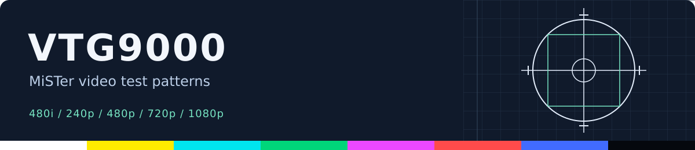
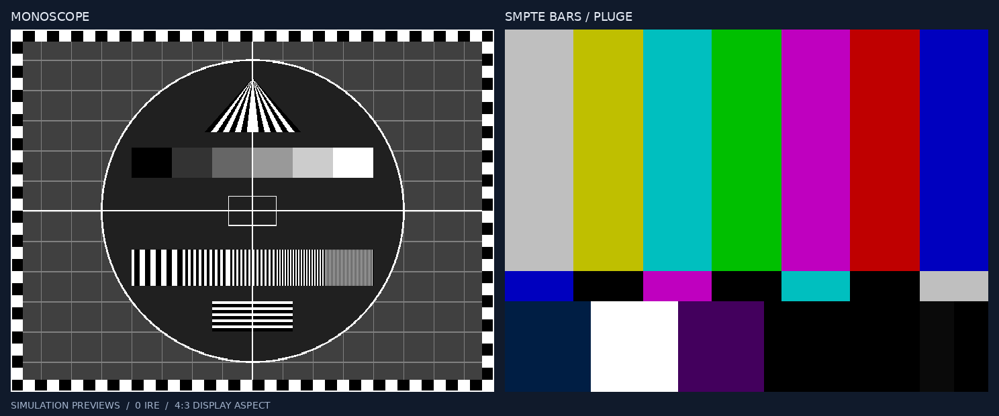

# VTG9000 MiSTer

> **LLM disclosure:** Large language models were used extensively to develop and
> revise this project's HDL, tests, and documentation. Simulation and successful
> builds do not establish hardware or analog accuracy.



VTG9000 is a MiSTer video test-pattern generator inspired by the Extron VTG 400
DVI. It provides 18 patterns for checking geometry, focus, grayscale, color,
and black level, including bars, PLUGE, crosshatches, ramps, and a monoscope.
It is an independent behavioral implementation and does not run Extron firmware.



*Simulator renders at 4:3 display aspect, not hardware captures.*

## Color accuracy

Remember that when using the MiSTer with an analog display the color accuracy will
be largely dependent on how good of a DAC you're using. See [Kuro Houou](https://x.com/kurohouou)'s excellent [DAC Test Results spreadsheet](https://tinyurl.com/dactestresults) for guidance on picking a DAC to pair
with your MiSTer.

## How to use it

1. [Download the latest RBF](https://github.com/99z/vtg9000/raw/refs/heads/main/releases/VTG9000_20261005_r5.rbf)
   or build it below. Copy it to `/media/fat/_Utility/` and select it from the
   MiSTer menu. Keep a previous revision for rollback.
2. Open the OSD to choose a pattern, level, RGB channels, inversion, raster
   border, or black pedestal. **0 IRE** is the default; **7.5 IRE** selects a
   digital setup pedestal, whose analog result depends on your output adapter.
3. Choose **Resolution**: 15 kHz (default), 480p, 720p, 1080p, or 720p 120 Hz.
   Under 15 kHz, **15 kHz Format** selects 480i (default) or 240p.

Native modes are 720x480i59.94, 720x240p60.05, 720x480p59.94, 916x720p60/120,
and 1360x1080p60. The HD dimensions match the Asteroids core's native rasters.
Use a compatible display for the selected native rate. With `vga_scaler=0`,
VGA uses that native mode; ordinary HDMI uses MiSTer's configured scaler.
Sync follows MiSTer.ini. HDMI downscaling uses nearest-neighbor.

| Keyboard | Controller | Action |
| --- | --- | --- |
| Left / Right | D-pad Left / Right | Previous / next pattern |
| Up / Down | D-pad Up / Down | Level ±1% (hold to repeat) |
| Page Up / Page Down | Level +10% / −10% buttons | Level ±10% |
| Home / End | — | Level 0% / 100% |
| I | Invert button | Inversion / SMPTE blue-only |
| R | Raster Border button | Toggle border |

Controller actions can be remapped through MiSTer's input settings.
[Release files and build records](docs/build-and-deployment.md) identify the
latest recorded RBF; display and analog validation are recorded separately.

## How to build it

On Ubuntu, install the simulation tools and Podman:

```sh
sudo apt-get install -y build-essential iverilog verilator python3 podman
make test lint lint-top
make -j8 verify-frames
QUARTUS_OUTPUT_DIR="$PWD/build/quartus-local" ./tools/quartus_container_build.sh
```

The wrapper downloads a several-gigabyte **Quartus 17.0.2** image on first use.
Choose a new output directory for each build. The RBF is
`build/quartus-local/VTG9000.rbf`; review `VTG9000.sta.summary` and the
`release-*.rpt` timing reports for violations before using it.

For contributions, start with [AGENTS.md](AGENTS.md) and
[development notes](docs/development.md). Detailed
[video timing](docs/video-modes.md), [pattern basis](docs/manual-pattern-basis.md),
and [future work](docs/roadmap.md) live outside this README.
